# Logical Diagram — Lumina v2 Architecture Reference

**Doc ID:** DOC-LOGICAL-DIAGRAM  
**Version:** 1.0  
**Status:** VALIDATED  
**Depends on:** All architecture docs, ADRs, business rules, runtime code, research docs

---

## 1. Global End-to-End Architecture Diagram

```mermaid
graph TB
    subgraph User["USER LAYER"]
        U[Leader / Admin / Treasurer / Pastor]
    end

    subgraph Client["CLIENT APP - React Native + Expo"]
        subgraph UI["Presentation Layer"]
            Login[Login Screen]
            Dash[Dashboard]
            Ledger[Grand Livre / Ledger]
            Forms[Dynamic Forms (Forms Engine)]
            Nav[Bottom Nav + Expo Router]
        end

        subth[Theme System]
        Theme[src/core/theme.ts] -->|accent tokens| Nav
        Theme -->|accent tokens| Forms
        Theme -->|accent tokens| UI
    end

    sub Runtime["RUNTIME CORE"]
        sub ManifestE["Manifest Engine"]
            MP[YAML Parser]
            AJV[AJV Schema Validator]
            CrossRef[Cross-Reference Resolver<br/>Kahn topo sort + cycle detection]
            ZodZ[Zod Type-Safety Verify]
            LRU[LRU Cache<br/>per-orgId, TTL 5min]
        end

        sub VocabE["Vocabulary Engine"]
            TermLookup[Term Lookup]
            EnumGen[Enum Generation]
            i18n[i18n Labels FR/EN]
        end

        sub FormsE["Forms Engine"]
            FormMapper[Field Type Mapper<br/>text/email/number/select/date...]
            RNComp[React Native Components Gen]
            ZS[react-hook-form + Zod resolver]
        end

        sub WorkflowE["Workflow Engine"]
            JRE[json-rules-engine<br/>approval rules]
            StepExec[Step Executor]
            NotifNotify[Notification Trigger]
        end

        sub CapabE["Capability Engine"]
            Toggle[Feature Toggles]
            HotSwap[HotSwap Engine<br/>activate/deactivate/rollback]
            Reg[SafeCapabilityRegistry<br/>action whitelist]
        end

        RBAC["RBAC Layer<br/>hasPermission() + useCan()<br/>wildcard matching *"]
        EventBus["TypedEventBus<br/>transactionCreated/approved<br/>syncComplete"]
    end

    sub Offline["OFFLINE RUNTIME"]
        OCache[OfflineRuntimeCache<br/>L1 RAM / L2 SQLite / L3 FS]
        VStack[VersionStack<br/>keep last 3 manifests]
        CResolver[ManifestConflictResolver<br/>jsondiffpatch merge]
        ConnListen[ConnectivityListener<br/>NetInfo + OpQueue]
    end

    sub DataLayer["DATA LAYER"]
        WDB[WatermelonDB<br/>SQLite ACID Local DB]
        WMSub[WalmartDB Reactive Subscriptions]
        Repo[Type-safe Repositories<br/>TransactionRepository etc.]
    end

    sub Server["SERVER - InsForge Cloud"]
        EF1[Edge Functions<br/>validate-transaction<br/>calculate-bilan<br/>send-notification]
        RLS["PostgreSQL RLS<br/>org_id isolation ONLY<br/>no role in policies"]
        POSTG[(PostgreSQL 16)]
        S3[S3 Storage<br/>receipts / profiles / exports]
        RT[Realtime Channels]
    end

    U -->|JWT Login| Login
    Login -->|session 30d| Dash
    Dash -->|useCan() gate| Ledger
    Dash -->|FAB quick actions| Forms
    Nav -->|Expo Router dynamic| Forms

    U -->|x-org-id header| EF1
    Forms -->|render JSON def| FormsE
    FormsE -->|read enums| VocabE
    FormsE -->|check feature flag| CapabE

    WorkflowE -->|read enums| VocabE
    WorkflowE -->|check permissions| CapabE
    WorkflowE -->|trigger approval| JRE
    JRE -->|amount >= threshold| NotifNotify

    ManifestE -->|compiled config| CapabE
    ManifestE -->|roles graph| RBAC
    ManifestE -->|settings| Dashboard

    CapabE -->|hot-swap events| EventBus
    FormsE -->|form render events| EventBus
    WorkflowE -->|workflow transitions| EventBus

    EventBus -->|fan-out to listeners| WDB
    EventBus -->|state sync| OCache

    WDB -->|push ops| ConnListen
    WDB -->|reactive queries| Repo
    Repo -->|local ACID read| WDB

    ConnListen -->|online: full sync| EF1
    ConnListen -->|metered: delta only| EF1
    ConnListen -->|offline: queue op| WDB

    EF1 -->|verify JWT + org_id| RLS
    EF1 -->|read/write| POSTG
    RLS -->|org_id filter| POSTG
    POSTG -->|return data| EF1
    EF1 -->|response| WDB
    POSTG -->|RT push| RT
    RT -->|realtime update| WDB
    EF1 -->|uploads| S3
    S3 -->|presigned URL| EF1

    style User fill:#1a1a2e,color:#fff
    style Client fill:#16213e,color:#fff
    style Runtime fill:#0f3460,color:#fff
    style Offline fill:#1a1a4e,color:#fff
    style DataLayer fill:#162447,color:#fff
    style Server fill:#1b1b2f,color:#fff
```

---

## 2. Five Engines Runtime Diagram

```mermaid
graph LR
    subgraph Input["INPUT: manifest.yaml"]
        YAML[Raw YAML String]
    end

    subgraph Compile["MANIFEST COMPILER"]
        YAML -->|js-yaml.safeLoad| Parsed[JSON Object]
        Parsed -->|AJV schema validate| Validated[Schema-Valid JSON]
        Validated -->|cross-ref resolve| Resolved[Graph Resolved<br/>cycle-checked]
        Resolved -->|Zod parse| Typed[CompiledRuntimeConfig]
        Typed -->|cache| LRU{LRU Cache<br/>per orgId}
    end

    subgraph Engines["FIVE ENGINES"]
        Manifest["Manifest Engine<br/>→ Capability<br/>→ Vocabulary(read)<br/>→ Workflow(read)<br/>→ Forms(read)"]

        Vocab["Vocabulary Engine<br/>→ NONE<br/>(pure read layer)"]

        Forms["Forms Engine<br/>→ Vocabulary<br/>→ Capability<br/>→ Manifest(config)"]

        Workflow["Workflow Engine<br/>→ Capability<br/>→ Manifest(config)<br/>→ Vocabulary"]

        Capability["Capability Engine<br/>→ Manifest(read)<br/>→ HotSwap<br/>→ Whitelist"]
    end

    subgraph Security4["4 SECURITY LAYERS"]
        S1["L1: SafeCapabilityRegistry<br/>whitelist action handlers"]
        S2["L2: ResourceBudgetEnforcer<br/>max fields/workflows/depth"]
        S3["L3: ManifestPipelineGuardian<br/>parse->schema->budget->compile"]
        S4["L4: JSONata Sandbox<br/>AST-safe eval, fn allowlist"]
    end

    subgraph OfflineCache["OFFLINE CACHE"]
        OC["L1 RAM (5min TTL)<br/>L2 WatermelonDB<br/>L3 FileSystem"]
    end

    Manifest -->|loads org config| Capability
    Manifest -->|provides vocab list| Vocab
    Manifest -->|provides form defs| Forms
    Manifest -->|provides workflow defs| Workflow
    Manifest -->|config settings| LRU

    Vocab -->|labels/enums| Forms
    Vocab -->|enums| Workflow
    Capability -->|feature toggle check| Forms
    Capability -->|permission check| Workflow

    Forms -->|emit render| UserForms[User Forms (React Native)]
    Workflow -->|execute steps| WorkSteps[Workflows Executing]
    Capability -->|toggle on/off| CapMods[Capability Modules]

    Capability -->|security audit| S1
    Capability -->|enforce budgets| S2
    S3 -->|orchestrate| S1
    S3 -->|orchestrate| S2
    S4 -->|sandboxes expressions| Forms

    LRU -->|persist to disk| OC
    Capability -->|hot-swap| HotEngine[HotSwap Engine]

    style Input fill:#1a1a2e,color:#fff
    style Compile fill:#0f3460,color:#fff
    style Engines fill:#162447,color:#fff
    style Security4 fill:#3a0a0a,color:#fff
    style OfflineCache fill:#1a1a4e,color:#fff
```

---

## 3. Manifest Compilation Pipeline

```mermaid
flowchart TD
    Start([YAML Source File]) --> Step1["ETAPA 1: YAML Parse<br/>js-yaml.safeLoad()<br/>~0.8-15ms<br/>Reject !!js/function !!python/object"]

    Step1 --> Step2["ETAPA 2: AJV Schema Validate<br/>Compiled native validator<br/>~0.5ms<br/>Required fields, types, formats<br/>enum, min/max, additionalProps"]

    Step2 --> Step3["ETAPA 3: Cross-Reference Resolve<br/>buildRoleGraph Kahn topo sort<br/>buildDeptTree with role refs<br/>buildFeatureRegistry<br/>Detect dependency cycles O(V+E)"]

    Step3 --> Step4["ETAPA 4: Zod Runtime Verify<br/>Parsed with z.object().refine()/.default()<br/>~1-8ms<br/>Guarantees TS type safety 100%<br/>Wildcard perms: ['*'] audited"]

    Step4 --> Step5["ETAPA 5: LRU Cache Write<br/>Key: orgId<br/>TTL: 5 min<br/>Size: 128 entries max<br/>SHA-256 checksum computed"]

    Step5 --> End([CompiledRuntimeConfig])

    Step2 -.error.--> Err1[ManifestValidationError<br/>with detailed paths]
    Step3 -.error.--> Err2[ManifestCycleError<br/>cycle node IDs listed]
    Step4 -.error.--> Err3[Zod ValidationError<br/>field-level details]
    Step5 -.timeout.--> Err4[SecurityError: COMPILE_TIMEOUT]

    style Start fill:#2d1b69,color:#fff
    style Step1 fill:#11998e,color:#fff
    style Step2 fill:#11998e,color:#fff
    style Step3 fill:#11998e,color:#fff
    style Step4 fill:#11998e,color:#fff
    style Step5 fill:#11998e,color:#fff
    style End fill:#38ef7d,color:#000
    style Err1 fill:#e51332,color:#fff
    style Err2 fill:#e51332,color:#fff
    style Err3 fill:#e51332,color:#fff
    style Err4 fill:#e51332,color:#fff
```

---

## 4. RBAC + RLS Integration Diagram

```mermaid
flowchart LR
    subgraph ClientFlow["CLIENT FLOW"]
        Login[Email+Password Auth] -->|POST /api/auth/login| EdgeFunc[Edge Function]
        EdgeFunc -->|validate credentials| PG1[(PostgreSQL)]
        PG1 -->|user + role| EdgeFunc
        EdgeFunc -->|load manifest roles| ManifestConf[manifest.yaml roles section]
        ManifestConf -->|resolve perms per role| JWTBuilder[Build JWT]
        JWTBuilder -->|payload: { userId, orgId, role, permissions[] }| JWT[JWT Token]
        JWT -->|stored expo-secure-store| ClientApp[React Native App]
    end

    subgraph ClientCheck["CLIENT PERMISSION CHECK"]
        ClientApp -->|useCan('finance:ledger:write')| HasPerm[hasPermission(permList, required)]
        HasPerm -->|exact match or wildcard 'module:*'| ShowBtn[Render UI Button]
        HasPerm -->|no match| HideBtn[Button Hidden - 403 never reached]
    end

    subgraph ServerFlow["SERVER AUTHORIZATION"]
        ClientApp -->|PUT /transactions/{id}| Req[HTTP Request w/ JWT + x-org-id]
        Req --> EdgeGuard[Edge Function authorize()]
        EdgeGuard -->|decode JWT, extract role+orgId| OrgCheck[SELECT role FROM org_members<br/>WHERE user_id=X AND org_id=Y]
        OrgCheck -->|role found| LoadManifest[load manifest.yaml for org]
        LoadManifest -->|get role.permissions[]| PermMatch[hasPermission(userPerms, required)]
        PermMatch -->|ALLOWED| DBWrite[INSERT/UPDATE via PostgREST]
        PermMatch -->|FORBIDDEN| Reject403({HTTP 403})
    end

    subgraph DBLayer["DATABASE LAYER"]
        DBWrite --> RLS[(PostgreSQL RLS Policy)]
        RLS -->|USING org_id = current_setting('app.current_org_id')| TxTable[(transactions table)]
        RLS -->|Org A cannot see Org B| Inv403({RLS BLOCK})
    end

    subgraph OrgMembers["org_members TABLE<br/>(1 table - NO many-to-many)"]
        OM[user_id UUID] --> PK[PRIMARY KEY id UUID]
        OM --> OrgId[org_id UUID FK->organizations]
        OM --> Role[role org_role ENUM]
        OM --> JoinsAt[joined_at timestamptz]
        Constraint{"CHECK:<br/>org always has admin"}
    end

    subgraph RoleDefinitions["manifest.yaml roles"]
        SA["superadmin → ['*'] hlevel:5"]
        AD["admin → finance:*, members:*,<br/>events:*, settings:* hlevel:4"]
        TR["treasurer → finance:ledger:*<br/>finance:bilan:read hlevel:3"]
        PA["pastor → finance:ledger:read<br/>members:directory:read hlevel:2"]
        SF["staff → finance:ledger:read<br/>members:directory:read hlevel:1"]
    end

    Style RoleDefinitions
    style ClientFlow fill:#16213e,color:#fff
    style ClientCheck fill:#0f3460,color:#fff
    style ServerFlow fill:#1a1a4e,color:#fff
    style DBLayer fill:#2d1b69,color:#fff
    style OrgMembers fill:#11998e,color:#fff
    style RoleDefinitions fill:#38ef7d,color:#000
    style Reject403 fill:#e51332,color:#fff
    style Inv403 fill:#e51332,color:#fff
```

---

## 5. Feature Lifecycle Diagram

```mermaid
flowchart TD
    subgraph Dev["DEVELOPMENT PHASE"]
        D1[Create src/features/X/<br/>.types.ts + .service.ts]
        D2[Create X.plugin.ts<br/>registry.register(plugin)]
        D3[Create X.routes.ts<br/>routeRegistry.addRoute()]
        D4[Define feature flag<br/>FLAG_DEFS.x_module = {...}]
    end

    subgraph Bootstrap["APP BOOTSTRAP"]
        B1[Import all feature modules<br/>side-effects register themselves]
        B2[Load manifest from server/cache]
        B3[HotSwapEngine.loadManifest(manifest)]
        B4[HotSwapEngine.activateAllFromManifest()]
    end

    subgraph Activate["FEATURE ACTIVATION"]
        A1[Feature enabled in manifest?]
        A2[HotSwapEngine.activateFeature(id)]
        A3[module.validate() - check permissions/device]
        A4[savePreviousState(runtime)]
        A5[module.mount() - register routes,<br/>subscribe WatermelonDB, attach hooks]
        A6[hotSwapEngine.registerModule(module)]
    end

    subgraph Runtime["RUNTIME USAGE"]
        R1[Feature active: routes visible, data flowing]
        R2[WatermelonDB subscriptions active]
        R3[Workflows executing, emitting events]
        R4[useCan() gates rendered correctly]
    end

    subgraph Toggle["TOGGLE CHANGE (manifest updated)"]
        T1[Admin edits manifest on server]
        T2[App receives manifest update<br/>via sync or push]
        T3[HotSwapEngine.detectToggleChanges()]
        T4{Changes detected?}
        T5[For each toggled OFF:<br/>deactivateFeature(id)]
        T6[For each newly enabled:<br/>activateFeature(id)]
    end

    subgraph Deactivate["FEATURE DEACTIVATION"]
        Dc1[Pause running workflows<br/>WorkflowBridge.pauseAll()]
        Dc2[Unsubscribe WatermelonDB + NetInfo]
        Dc3[unregisterAll routes from nav container]
        Dc4[null component refs -> React GC]
        Dc5[module.unmount()]
    end

    subgraph Rollback["ROLLBACK PATH"]
        Ra1{activateFeature crashes?}
        Ra2[HotSwapEngine.rollbackFeature(id)]
        Ra3[Restore previous state snapshot]
        Ra4[Show error toast, feature unmounted]
        Ra5{hot-swap new version fails?}
        Ra6[Re-activate old version<br/>fallback to saved module]
    end

    D1 --> D2 --> D3 --> D4 --> B1 --> B2 --> B3 --> B4 --> A1
    A1 -->|yes| A2 --> A3 --> A4 --> A5 --> A6 --> R1 --> R2 --> R3 --> R4
    A1 -->|no| R1R[Rfeature inactive - skipped]
    R4 --> T1 --> T2 --> T3 --> T4
    T4 -->|added/toggled on| T6
    T4 -->|removed/toggled off| T5
    T5 --> Dc1 --> Dc2 --> Dc3 --> Dc4 --> Dc5
    T6 --> A1b[Same as activate path]
    A3 -->|throw crash| Ra1
    Ra1 -->|yes| Ra2 --> Ra3 --> Ra4
    Dc1 -->|throw crash| Ra5
    Ra5 -->|yes| Ra6

    style Dev fill:#1a1a2e,color:#fff
    style Bootstrap fill:#0f3460,color:#fff
    style Activate fill:#162447,color:#fff
    style Runtime fill:#11998e,color:#fff
    style Toggle fill:#3867d6,color:#fff
    style Deactivate fill:#e51332,color:#fff
    style Rollback fill:#ffb800,color:#000
```

---

## 6. Offline Sync Diagram

```mermaid
flowchart TB
    subgraph Local["LOCAL FIRST (WatermelonDB)"]
        LDB[(SQLite ACID DB)]
        Ops[Pending Operations Queue]
        Conflict[Conflict Resolver]

        LDB -->|mutations queue| Ops
    end

    subgraph Connectivity["CONNECTIVITY LAYER"]
        NetInfo[NetInfo Listener<br/>online/offline/metered]
        QM[Queue Manager<br/>WiFi: full sync<br/>Cellular: delta-only]
    end

    subgraph Push["PUSH: Local -> Server"]
        P1[Batch operations<br/>max 50 per batch]
        P2[x-org-id header mandatory<br/>NB-RULE-04]
        P3[POST /api/operations/sync]
        P4[Edge Function validates:<br/>auth + org_id + immutability<br/>INV-001 check: approved tx immutable]
    end

    subgraph Pull["PULL: Server -> Local"]
        Pull1[GET /api/operations/sync?since=<ts>]
        Pull2[Edge returns delta changes<br/>filtered by org_id via RLS]
        Pull3[Merge into LDB:<br/>server-wins for approved tx<br/>LWW for members/events]
    end

    subgraph Confirm["ACKNOWLEDGMENT"]
        C1[POST /api/operations/confirm]
        C2[Server marks ops complete]
        C3[DELETE local completed ops]
    end

    subgraph ManifestSync["MANIFEST SYNC"]
        M1[GET latest manifest from server]
        M2[Compare versions: manifest_diff_check]
        M3{Different?}
        M4[Run ManifestConflictResolver<br/>strategy: merge/client-wins/server-wins]
        M5[VersionStack.append(new version)]
        M6[Trigger HotSwapEngine.applyManifestUpdate()]
    end

    subgraph ConflictStrats["CONFLICT RESOLUTION STRATEGIES"]
        CT["Transactions draft: client-wins<br/>UUID dedup + side-by-side diff"]
        CA["Approved transactions: immutable<br/>no sync write allowed (INV-001)"]
        CM["Members: Last-Writer-Wins<br/>timestamp-based"]
        CE["Events: LWW + notification"]
        CF["Forms: server-wins if schema mismatch"]
    end

    subgraph VersionStack["VERSION STACK<br/>(last N = 3)"]
        V1[Manifest vN+1 deployed]
        V2[Manifest vN cached]
        V3[Manifest vN-1 rollback point]
    end

    Local -->|network available| Connectivity
    Connectivity -->|full sync WiFi| Push
    Connectivity -->|delta only cellular| Push
    Connectivity -->|offline| Ops

    Push --> P1 --> P2 --> P3 --> P4
    P4 -->|success| Pull
    P4 -->|conflict| M3

    Pull --> Pull1 --> Pull2 --> Pull3

    Ops -->|all ops done| Confirm
    Confirm --> C1 --> C2 --> C3

    M1 --> M2 --> M3
    M3 -->|changed| M4 --> M5 --> M6
    M3 -->|same| NoChange[No change needed]

    M4 --> CT
    M4 --> CA
    M4 --> CM
    M4 --> CE
    M4 --> CF

    V1 --> VStack
    V2 --> VStack
    V3 --> VStack

    style Local fill:#162447,color:#fff
    style Connectivity fill:#0f3460,color:#fff
    style Push fill:#11998e,color:#fff
    style Pull fill:#3867d6,color:#fff
    style Confirm fill:#38ef7d,color:#000
    style ManifestSync fill:#e51332,color:#fff
    style ConflictStrats fill:#ff6b00,color:#fff
    style VersionStack fill:#2d1b69,color:#fff
```

---

## 7. Critical Data Flow Matrix

```mermaid
flowchart LR
    subgraph FP["FLOW 1: LOGIN"]
        U1[User enters email+pwd] --> AuthScreen[Login Screen RN]
        AuthScreen --> SecureStore[Read cached token?<br/>expo-secure-store]
        SecureStore -->|valid 30-day session| SkipAuth[DASHBOARD DIRECT]
        SecureStore -->|expired/none| APICall[POST /api/auth/login]
        APICall -->|x-org-id header| EdgeAuth[Edge Function<br/>validate-credentials]
        EdgeAuth -->|query org_members| PGAuth[(PostgreSQL)]
        PGAuth -->|role + org_id| EdgeAuth
        EdgeAuth --> BuildJWT[Build JWT:<br/>userId, orgId, role,<br/>permissions[] from manifest]
        BuildJWT --> StoreToken[Store in expo-secure-store]
        StoreToken --> FetchOrg[FETCH org config + theme]
        FetchOrg --> RuntimeInit[RuntimeStateStore.init(orgId)]
        RuntimeInit --> BootstrapEngines[Topological engine boot:<br/>Manifest -> Vocab -> Forms/Capab -> Workflow]
        BootstrapEngines --> Dashboard[Dashboard Rendered]
    end

    subgraph FP2["FLOW 2: CREATE TRANSACTION"]
        UI1[User taps FAB > New Transaction] --> UI2[Forms Engine renders form<br/>from compiled manifest definition]
        UI2 --> Validate1[Client validation:<br/>Zod + financial rules BR-FIN-001..005]
        Validate1 --> Submit[User submits]
        Submit --> LocalWrite[WatermelonDB INSERT<br/>status='draft' | INV-006: local before remote]
        LocalWrite --> Optimistic[Optimistic UI: item appears in list]
        Optimistic --> AsyncPush[Push to server:<br/>POST /api/operations/sync<br/>x-org-id from JWT]
        AsyncPush --> EdgeTx[Edge Function validate-transaction]
        EdgeTx --> CheckAuth{role has finance:ledger:write?}
        CheckAuth -->|no| Reject403(HTTP 403)
        CheckAuth -->|yes| CheckBR[Biz Rules: BR-FIN-010..013<br/>amount < max_auto_approve?<br/>amount >= large_threshold?]
        CheckBR -->|auto-approve| SetDraft[Set status='draft'->'approved']
        CheckBR -->|needs approval| SetPending[Set status='pending'<br/>emit EventBus transactionNeedsApproval]
        SetPending --> Notif[send-notification edge function<br/>notify treasurer]
        SetDraft --> Ack[Server ACK + confirm]
        Ack --> MarkComplete[Mark op complete in queue]
        MarkComplete --> SyncBack[PULL remote data<br/>refresh local LDB]
    end

    subgraph FP3["FLOW 3: APPROVE TRANSACTION"]
        A1[Treasurer sees pending tx] --> A2{useCan('finance:ledger:approve')}
        A2 -->|no| HideBtn[Approve button hidden]
        A2 -->|yes| A3[View transaction detail]
        A3 --> A4[Tap Approve + comment]
        A4 --> A5[PATCH /transactions/{id}<br/>status='approved', approvedBy=me]
        A5 --> EdgeApprove[Edge Function authorize approval]
        EdgeApprove --> RLSCheck[RLS: org_id matches?]
        RLSCheck -->|no| BlockInv[RLS blocks query]
        RLSCheck -->|yes| ImmCheck{is transaction approved?}
        ImmCheck -->|already approved| INV1VIOLATE[INV-001 VIOLATION BLOCK<br/>(should not happen: RLS only allows draft/pending update)]
        ImmCheck -->|draft/pending| OK[SET status='approved'<br/>audit log created INV-007]
        OK --> EvtAudit[EventBus emit: transactionApproved]
        EvtAudit --> InvalReport[Report generator invalidates cache]
    end

    subgraph FP4["FLOW 4: OFFLINE ACTION"]
        O1[Device offline: NetInfo -> 'offline'] --> O2[User creates transaction]
        O2 --> O3[WatermelonDB write (ACID local)]
        O3 --> O4[Op queued in pending queue<br/>type: 'transaction_create']
        O4 --> O5[UI shows offline badge<br/>connection status indicator]
        O5 --> O6[Device reconnected: NetInfo -> 'online']
        O6 --> O7[ConnectivityListener emits 'reconnected']
        O7 --> O8[executePendingOps(): batch send ops]
        O8 --> O9[Server processes, conflicts?]<br/>Merge conflict
        O9 -->|no conflict| O10[Confirm ops, clear queue]
        O9 -->|conflict| ConfRes[ConflictResolver:<br/>draft=client-wins, approved=immutable]
        ConfRes --> O10

        style FP4 fill:#16213e,color:#fff
    end

    subgraph FP5["FLOW 5: FEATURE TOGGLE"]
        F1[Admin edits manifest<br/>toggle finance_ledger_v2 enabled]
        F1 --> F2[Server stores new manifest<br/>VersionStack: N -> N+1]
        F2 --> F3[App receives manifest update<br/>via sync or push notification]
        F3 --> F4[OfflineRuntimeCache.refreshFromServer()]
        F4 --> F5[HotSwapEngine.applyManifestUpdate()]
        F5 --> F6[detectToggleChanges():<br/>added=[], removed=[], toggled=['finance_ledger']]
        F6 --> F7[deactivateFeature(finance_ledger_v1)]
        F7 --> PauseW[Pause workflows]
        PauseW --> Unsub[Unsubscribe WatermelonDB]
        Unsub --> Unreg[Unregister routes]
        Unreg --> F8[activateFeature(finance_ledger_v2)]
        F8 --> Validate[module.validate()]
        Validate --> Mount[module.mount()<br/>new routes + subscriptions]
        Mount --> ManifestCompile[New manifest compiled:<br/>YAML->AJV->Zod->LRU]
        ManifestCompile --> NewUI[New form/screens visible]
    end

    style FP fill:#1a1a2e,color:#fff
    style FP2 fill:#0f3460,color:#fff
    style FP3 fill:#162447,color:#fff
    style FP5 fill:#2d1b69,color:#fff
```

---

## 8. CI/CD Deployment Pipeline

```mermaid
flowchart LR
    subgraph CodeStage["CODE STAGE"]
        C1[Developer commits to feature branch]
    end

    subgraph PreCommit["PRE-COMMIT HOOKS"]
        P1[lint-staged: eslint --fix staged files]
        P2[TypeScript: npx tsc --noEmit]
        P3[NeverBreak checks:<br/>NB-RULE-01: doc < 400 lines<br/>NB-RULE-05: YAML JSON Schema valid<br/>NB-RULE-07: no-explicit-any ESLint]
    end

    subgraph CICD["CI PIPELINE - GitHub Actions"]
        CI1[Push to PR/main]
        CI2[Install deps: npm ci]
        CI3[Lint: npm run lint -- --max-warnings=0]
        CI4[Type Check: npx tsc --noEmit]
        CI5[Dependency Check: npm run dep-check<br/>Verify DAG: no cycles between engines]
    end

    subgraph TestStage["TEST STAGE"]
        TS1[Jest unit tests:<br/>vitest/jest --coverage]
        TS2[Coverage gate:<br/>finance >= 90% lines NB-RULE-09<br/>auth >= 90%, sync >= 90%]
        TS3[Invariant tests:<br/>data isolation multi-tenant<br/>double-validation client+server<br/>financial immutability]
        TS4[Maestro E2E tests:<br/>critical paths: login, create tx, approve]
    end

    subgraph BuildStage["BUILD STAGE"]
        BS1[EAS Build Android: eas build --platform android --profile preview]
        BS2[EAS Build iOS: eas build --platform ios --profile preview]
        BS3[Bundle analysis: react-native-bundle-visualizer]
        BS4[Hermes AOT compilation: enable in eas.json]
    end

    subgraph DeployStage["DEPLOY STAGE"]
        DS1[TestFlight / Play Console internal track]
        DS2[OTA Update: expo-updates publish<br/>partial bundles 20-50KB]
        DS3[Sentry release creation<br/>@sentry/react-native]
        DS4[InsForge deploy: migrations + edge functions]
    end

    C1 --> P1 & P2 & P3
    P1 -->|pass| CI1
    P3 -->|fail| Blocked1[BUILD BLOCKED:<br/>NeverBreak Rule violation<br/>comment on PR]
    CI1 --> CI2 --> CI3 --> CI4 --> CI5
    CI5 -->|cycle detected| Blocked2[BUILD BLOCKED:<br/>dependency-cycle-detected<br/>see Dependency-Contract §6]
    CI5 -->|pass| TS1
    TS1 --> TS2 --> TS3 --> TS4
    TS2 -->|finance < 90%| Blocked3[BUILD BLOCKED:<br/>NB-RULE-09 coverage threshold]
    TS4 -->|pass| BS1 & BS2
    BS1 --> BS3 --> BS4 --> DS1
    DS1 --> DS2 --> DS3 --> DS4

    style CodeStage fill:#1a1a2e,color:#fff
    style PreCommit fill:#11998e,color:#fff
    style CICD fill:#0f3460,color:#fff
    style TestStage fill:#162447,color:#fff
    style BuildStage fill:#3867d6,color:#fff
    style DeployStage fill:#38ef7d,color:#000
    style Blocked1 fill:#e51332,color:#fff
    style Blocked2 fill:#e51332,color:#fff
    style Blocked3 fill:#e51332,color:#fff
```



---

## Summary: How It All Fits Together

1. **Manifest is the source of truth**: Every behavior flows through the Manifest Compiler pipeline (YAML -> AJV -> Zod -> LRU Cache). The compiled `CompiledRuntimeConfig` drives all 5 engines.

2. **Engines are independent but connected**: Vocabulary is the purest layer (no dependencies). Forms depends on Vocabulary+Capability. Workflow depends on Capability+Forms. Everything is orchestrated by Manifest.

3. **Security is 4-layer deep**: Capability whitelist -> Resource budget -> Pipeline guardian -> JSONata sandbox. No eval(), no implicit capabilities, no stack overflow.

4. **Offline-first is guaranteed**: WatermelonDB provides ACID local writes. Connectivity listener queues operations. Sync uses push/pull with conflict resolution strategies per entity type.

5. **RBAC is minimalist**: 1 table (`org_members`), permissions in manifest.yaml, JWT contains resolved permissions. Edge function is the sole server authorization guard. RLS only enforces org isolation.

6. **Feature hot-swap is atomic**: activate/deactivate/rollback with automatic state preservation. If activation crashes, previous state is instantly restored. Routes, subscriptions, and workflows are properly cleaned up.

7. **Deployment is gated**: NeverBreak rules block builds automatically. Dependency cycles are detected. Finance coverage >= 90%. Multi-tenant isolation tested on every deployment.

---

*Logical Diagram v1.0 - REFERENCE ARCHITECTURE UNIQUE for Lumina v2*
